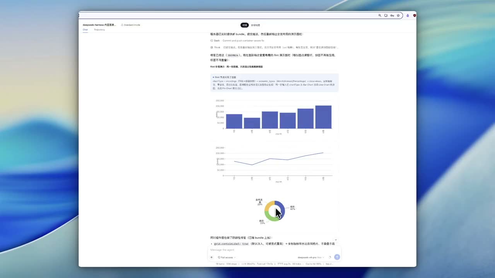

# 🎨 dsh-genui-charts

**English** · [简体中文](./README.zh-CN.md)

A [DeepSeek Harness](https://github.com/deepseek-ai/deepseek-harness) (dsh) plugin that renders interactive UI components **inline in assistant replies** through the ` ```dsh-ui ` fence. This repository is a fork of [`omdsh-dev/dsh-genui`](https://github.com/omdsh-dev/dsh-genui) that fuses two chart nodes into its vocabulary: **ECharts** (native options) and **Flint** (declarative `ChartAssemblyInput` compiled client-side to ECharts).

<p align="center">
  <a href="https://github.com/dofine/dsh-genui-charts/blob/main/assets/demo-flint-echarts.mp4">
    
  </a>
  <br>
  <em>▶ Click the image to play the demo — the same data re-rendered as bar / line / pie by changing only the Flint <code>chartType</code>, with hover tooltips confined to the chart block. <a href="https://github.com/dofine/dsh-genui-charts/raw/main/assets/demo-flint-echarts.mp4">Download the mp4</a></em>
</p>

## What this fork adds

On top of the upstream component set (cards, tables, forms, tabs, mermaid, 3D scenes, quizzes, …), this fork adds two chart nodes:

- **`echarts`** — `{"type":"echarts","option":{...},"height":n?}` renders any ECharts chart (bar / line / pie / scatter / heatmap / sankey …) with hover tooltips and zoom. The option is deep-sanitized: function-valued `formatter` / `renderItem` fields are stripped, so no script ever reaches the DOM. Tooltips are confined to the chart block, axis labels stay inside the grid margins, and pie charts switch to a compact layout in narrow containers.
- **`flint`** — `{"type":"flint","input":{...},"height":n?}` takes a declarative Flint `ChartAssemblyInput` (`chartType` + `encodings` + `semantic_types` + bound `data.values`) and compiles it client-side to an ECharts option via `flint-chart/echarts`. Semantic types (Amount / Percentage / Month / Category …) drive zero-baseline, axis formatting, and percentage labels automatically — the same input re-renders as another chart by changing one `chartType` field.

The engines ship as lazy on-demand assets (`lib/assets/echarts.js`, `lib/assets/flint.js`) served by the plugin's own HTTP routes, so the core client bundle stays light and conversations that never use charts never download them.

## Install

Prerequisites: `dsh` and `pnpm` on PATH.

```sh
git clone <this repo> && cd dsh-genui-charts
pnpm install
pnpm build          # lib/ is build output and is NOT committed
dsh plugin --profile web add link:$PWD
```

Then restart `dsh web` and hard-refresh the browser (Cmd+Shift+R).

## Use

Ask for a chart and the model emits a ` ```dsh-ui ` fence, which the browser half renders where it sits:

````markdown
```dsh-ui
{"type":"flint","input":{
  "data":{"values":[{"month":"1月","sales":128400},{"month":"2月","sales":96000}]},
  "semantic_types":{"month":"Month","sales":"Amount"},
  "chart_spec":{"chartType":"Bar Chart","encodings":{"x":{"field":"month"},"y":{"field":"sales"}}}
}}
```
````

The full node vocabulary and syntax live in [SKILL.md](./SKILL.md). Without this plugin installed, fences stay ordinary code blocks — no errors, no session pollution.

## Development

```sh
pnpm install
pnpm run check     # type check + tests + build
```

## Credit

This is a fork of [`omdsh-dev/dsh-genui`](https://github.com/omdsh-dev/dsh-genui) (MIT). Upstream authors own the original component set, renderer channels, and packaging; this fork adds the ECharts and Flint chart nodes described above.

## License

[MIT](./LICENSE), inherited from upstream.
